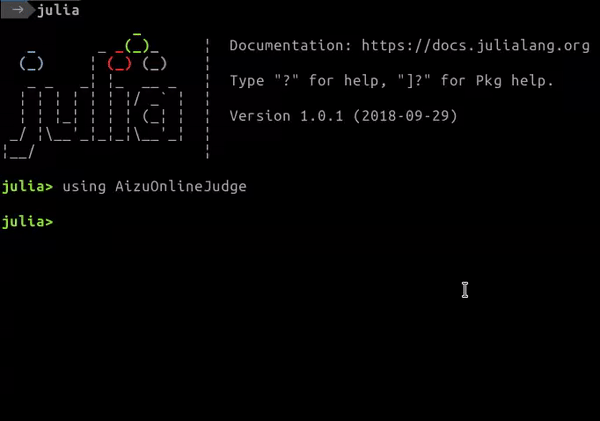

# AizuOnlineJudge.jl

[](https://travis-ci.org/goropikari/AizuOnlineJudge.jl)
[](https://ci.appveyor.com/project/goropikari/aizuonlinejudge-jl)
[](https://coveralls.io/github/goropikari/AizuOnlineJudge.jl?branch=master)
[](https://codecov.io/gh/goropikari/AizuOnlineJudge.jl)


This is a unofficial judge system of [Aizu Online Judge](https://onlinejudge.u-aizu.ac.jp/home) (AOJ) for [Julia](https://julialang.org/).


# Installation
```julia
using Pkg
Pkg.pkg"add https://github.com/goropikari/AizuOnlineJudge.jl"
```

# Usage
```julia
using AizuOnlineJudge
test_sample("ProblemId", "yourfile.jl", timelimit=1)
judge("ProblemId", "yourfile.jl", timelimit=1)
```

or

```bash
./aoj ProblemId yourfile.jl [time_limit] # default time limit is 1 second.
```


# Example
```julia
using AizuOnlineJudge
judge("ALDS1_1_B", "gcd.jl")
```

```julia
# gcd.jl
# ALDS1_1_B
x, y = parse.(Int, split(readline()))
mygcd(x,y) = y == 0 ? x : mygcd(y, mod(x,y))
println(mygcd(x,y))
```


